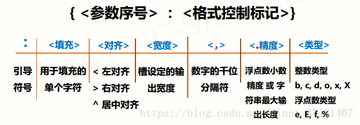

### 输入

- `n = int(input().strip())`
- `a, b = map(float, input().strip().split())`
- `data = map(int, input().strip().split())`
  `n, array = data[0], data[1:]`

### 输出

- `print(f'{1.1006:.3f}')`  `1.101`
- `print(f'{1.1004:.3f}')`  `1.100`
- `print(f'{4*5/2:.0f}')`  `10` （输出时注意除法，会有小数产生）
- `print(f'{65:c}')`  `A` （ASCII码）

### 技巧

- 多用 `math.pow(a, n)`
- `n & 1 == 0` 是否偶数
- `mid = left + ((right - left) >> 1)` 二分法取中点
- 